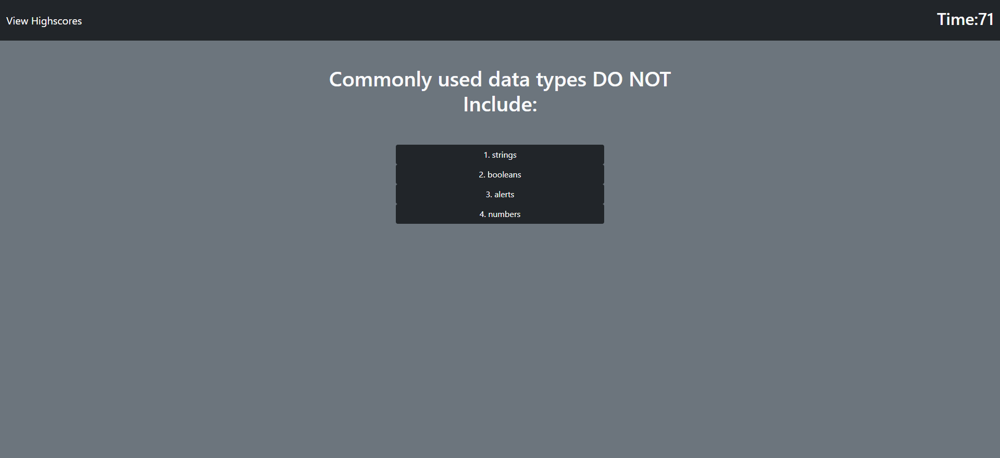
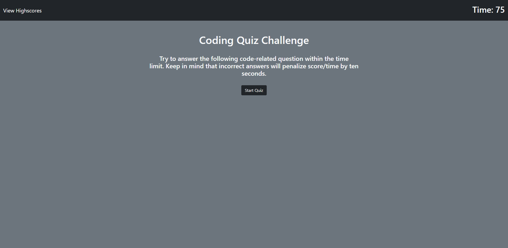

# Code_Quiz_NP

## Desciption

This a quiz application I created for homework assignment. It's got 5 questions and stores your score in local storage with your initials. It edits the html as you go through the questions and on the highscore pages edits and posts the scores.

## Screenshot

## Links

https://nickpodski.github.io/Code_Quiz_NP/ - Live URL
https://github.com/Nickpodski/CodeRefactor_NickP_Homework - Highscores
https://github.com/Nickpodski/Code_Quiz_NP - Git Hub Repo

## Credits

https://www.w3schools.com/ - W3 Schools

